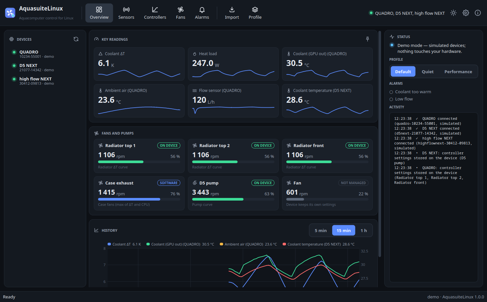
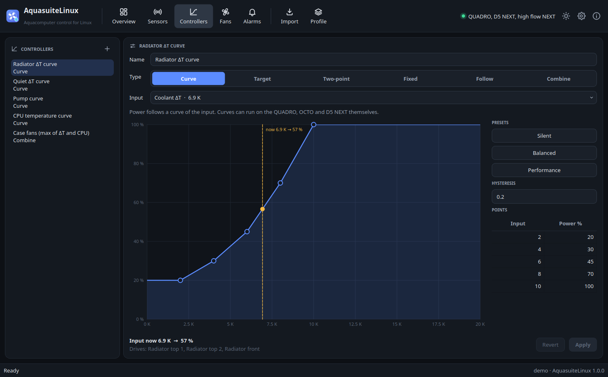
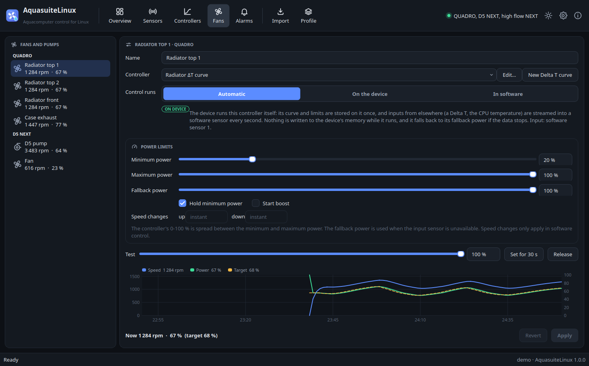
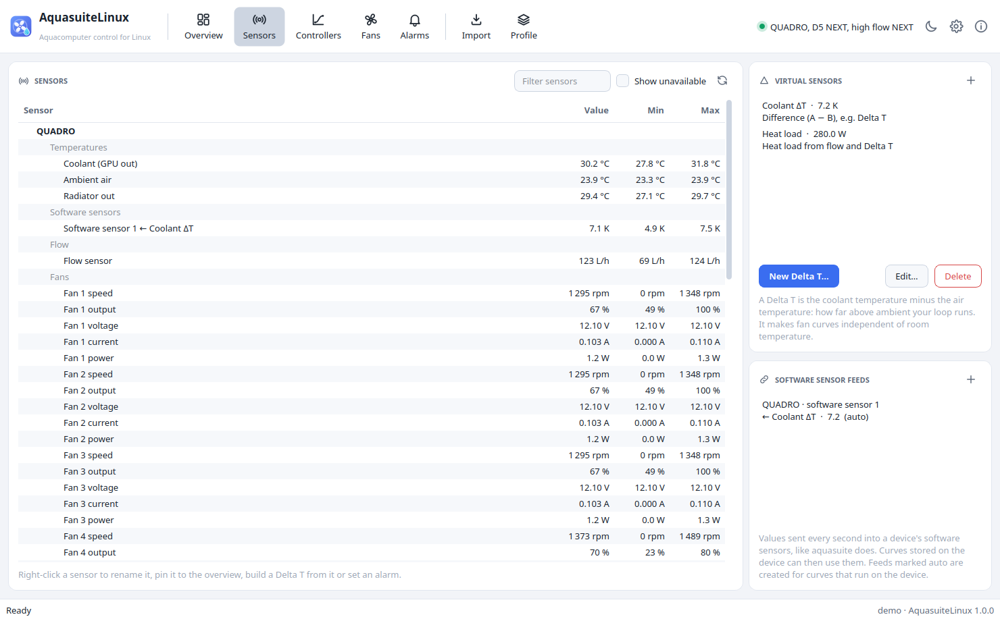
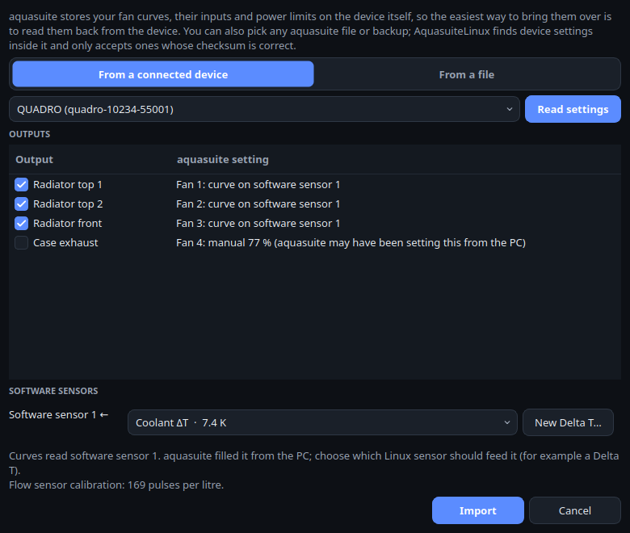

# AquasuiteLinux: Aquacomputer control for Linux

AquasuiteLinux is a native desktop app for **Aquacomputer water cooling devices**. It shows every
sensor, builds **virtual sensors such as Delta T** (how far your coolant is above ambient), runs
**fan curves and other controllers**, raises **alarms**, switches **profiles**, and **imports the fan
curves aquasuite stored on your devices**, so you don't have to set them up again. It is built for Arch
Linux and runs on any modern distribution, on X11 and Wayland.

It was designed around the **QUADRO** and supports every Aquacomputer device the Linux kernel knows:
OCTO, D5 NEXT, aquaero 5/6, farbwerk 360, farbwerk, high flow NEXT, LEAKSHIELD, aquastream ULTIMATE,
aquastream XT, poweradjust 3, high flow USB and mps flow.



> AquasuiteLinux is an independent project. It is not affiliated with, or endorsed by, Aqua Computer
> GmbH & Co. KG. "aquasuite", "QUADRO", "OCTO" and the other product names are their trademarks.

## Features

**Monitoring**
- Every sensor of every connected device: temperatures, flow, fan and pump speed, power, voltage,
  current, pressure, water quality and conductivity, supply voltages, and the devices' software sensors.
- The PC's own sensors too: CPU and GPU temperatures (AMD, Intel, NVIDIA through `nvidia-smi`), NVMe
  drives, motherboard chips and CPU load, so a fan curve can follow the CPU as well as the water.
- An **overview** with the readings you pick as live tiles with sparklines, every fan and pump at a
  glance, a history chart (5 min to 1 h, longer in the service), alarms and an activity log.
- Rename sensors ("Coolant in", "Ambient air"), min/max columns, and a **CSV data log**.

**Virtual sensors**
- **Delta T** (A − B): coolant temperature minus air temperature. A curve on Delta T keeps the loop the
  same number of degrees above the room, whatever the room temperature. There's a one-click
  *New Delta T* that suggests the air sensor for you.
- Average, minimum, maximum and sum of any sensors; scale and offset; constants; **formulas**
  (`max(a, b) - c`, comparisons, `clamp`, …); and **heat load** in watts from flow and the
  temperatures before and after a radiator.
- Optional smoothing, and virtual sensors can use other virtual sensors.

**Fan control**
- **Curve controller** drawn on a graph with **2 to 16 points**: set how many with − / + (new points land
  on the curve, so its shape stays until you move them), drag points, double-click to add one where you
  want it, right-click to remove it, arrow keys to fine-tune, a table for exact values, presets and
  hysteresis. A live marker shows where the input is right now and what the curve outputs.
- **Target value controller (PID)**, **two-point controller**, **fixed power**, **follow another
  output**, and **combine** (the highest, lowest or average of other controllers, e.g. "the higher of
  the Delta T curve and the CPU curve").
- Per output, as on the devices themselves: **minimum and maximum power**, **fallback power** when the
  input is unavailable, **hold minimum power** (instead of stopping the fan), **start boost**, and
  speed-change limits.
- **On the device or in software.** Curve controllers run on the QUADRO, OCTO and D5 NEXT themselves,
  the way aquasuite does: the curve is stored once. Curves on the device's own sensors always can;
  curves on inputs that live elsewhere (a Delta T, the CPU temperature, a sensor on another device) can
  when *Send sensor values to devices* is on (experimental, see below): the value is then streamed every
  second into one of the device's software sensors. Everything else runs in software. You choose per
  output, or let it decide.
- **Test** any output at a chosen power for 30 seconds.

**Bring your aquasuite setup over**
- aquasuite keeps curves, their inputs and power limits **on the device**. *Import* reads them back and
  turns them into controllers and output settings, merging outputs that share a curve.
- Curves that read an aquasuite **software sensor** (often a Delta T calculated by aquasuite) are
  imported with that slot noted; you pick the Linux sensor that should feed it, and AquasuiteLinux keeps
  feeding the same slot.
- It can also search **any file** (aquasuite data, XML, zip backups, …) for device settings; see
  [Coming from aquasuite](#coming-from-aquasuite-windows).

**Everything else**
- **Alarms** on any sensor (above, below, unavailable, with a delay) that show a notification, run all
  controlled fans at full power, run a command, or shut the computer down.
- **Profiles** ("Quiet", "Performance", …) that swap the controllers of chosen outputs, from the
  toolbar, the tray icon or `aquactl profile`.
- **Device settings**: temperature sensor offsets and flow sensor calibration stored on the device,
  and a settings **backup / restore**.
- A **background service** (`aquasuited`) keeps fan control running from boot, without the window
  open. Without it the app controls the fans itself while it runs.
- **Dark and light themes** that follow your desktop, in the same design as
  [ReolinkLinux](https://github.com/oreo1298/ReolinkLinux),
  [EZP2019Linux](https://github.com/oreo1298/EZP2019Linux) and
  [FirmwareLab](https://github.com/oreo1298/FirmwareLab).
- **Demo mode** with a simulated QUADRO, D5 NEXT and high flow NEXT on a simulated water loop, so you can
  try everything without touching hardware.
- A **command-line tool**, `aquactl`, for scripts, status bars and SSH.

| Fan curve editor | Fan and pump settings |
|---|---|
|  |  |

| Every sensor, virtual sensors and feeds (light theme) | Importing aquasuite curves from a QUADRO |
|---|---|
|  |  |

## Supported devices

AquasuiteLinux talks to the devices directly over USB (hidraw), speaking the same protocol as aquasuite.
When it can't open them (no udev rule yet, see below) it falls back to the Linux kernel's
`aquacomputer_d5next` driver for readings.

| Device | Sensors | Fan / pump control | Curves on the device | Software sensor feed |
|---|---|---|---|---|
| **QUADRO** | ✔ 4 temperatures, flow, 4 fans, 16 software sensors | ✔ 4 outputs | ✔ | ✔ |
| **OCTO** | ✔ 4 temperatures, flow, 8 fans, 16 software sensors | ✔ 8 outputs | ✔ | ✔ ¹ |
| **D5 NEXT** | ✔ coolant, flow, pump, fan, +5/+12 V | ✔ pump and fan | ✔ | — |
| **aquaero 5 / 6** | ✔ 8 temperatures, virtual, aquabus, 2 flow, 4 fans | ✔ 4 outputs (software) | — | — |
| **farbwerk 360** | ✔ 4 temperatures, 16 software sensors | — | — | ✔ ¹ |
| **farbwerk** | ✔ 4 temperatures | — | — | — |
| **high flow NEXT** | ✔ temperature, flow, quality, conductivity, heat | — | — | — |
| **LEAKSHIELD** | ✔ pressure, reservoir level, temperatures | — | — | ✔ pump speed and flow ² |
| **aquastream ULTIMATE** | ✔ temperatures, pump, fan, pressure, flow | — | — | — |
| **aquastream XT** | ✔ temperatures, pump and fan speed | ✔ pump and fan (software) | — | — |
| **poweradjust 3** | ✔ temperatures, fan, flow | — | — | — |
| **high flow USB / mps flow** | ✔ temperatures, flow | — | — | — |

Software sensor feeds and the LEAKSHIELD feed are **experimental and off by default** (Settings → *Send
sensor values to devices*, or `aquactl feeds on`): they use the devices' vendor USB bulk endpoint, which
isn't confirmed on real hardware yet. Until then, curves on a Delta T or a PC sensor run in software, which
works on every device. `aquactl doctor --feed-test` tells you whether your device takes the values.

¹ The layout is the QUADRO's; AquasuiteLinux checks that the device reports the values back and, if it
doesn't, controls those outputs in software instead and tells you.
² Gives the LEAKSHIELD the pump speed and flow it needs for its pressure model, as aquasuite does.

RGB lighting (RGBpx, farbwerk effects) is not supported: that part of the protocol isn't documented.

## Installation

AquasuiteLinux needs **Python 3.10+** and **PySide6** (Qt 6) for the app. The background service and
`aquactl` need nothing but Python.

### Arch Linux, CachyOS, EndeavourOS, Manjaro, Garuda and other Arch-based distributions

The repository includes a PKGBUILD, so the app installs as a normal pacman package with its menu entry,
icon, udev rule and systemd service:

```bash
sudo pacman -S --needed git base-devel
git clone https://github.com/oreo1298/AquasuiteLinux.git
cd AquasuiteLinux
makepkg -si
```

Then **re-plug your devices once** (or reboot) so the udev rule applies, and start **AquasuiteLinux**
from your application menu. To keep fan control running at boot and without the window:

```bash
sudo systemctl enable --now aquasuited
```

The service keeps its own settings (`/etc/aquasuitelinux/config.json`), separate from the app's when it
runs without it (`~/.config/aquasuitelinux/config.json`). If you set things up in the app first, it offers
to move them to the service the next time you open it (or: `aquactl config --load
~/.config/aquasuitelinux/config.json`).

(or *Settings → Enable background service* in the app). To update later:
`cd AquasuiteLinux && git pull && makepkg -sif`.

### Fedora

```bash
sudo dnf install git python3-pyside6
git clone https://github.com/oreo1298/AquasuiteLinux.git
cd AquasuiteLinux
./packaging/install.sh
```

### Debian 13, Ubuntu 25.04 and newer

```bash
sudo apt install git python3-venv python3-pyside6.qtwidgets python3-pyside6.qtsvg
git clone https://github.com/oreo1298/AquasuiteLinux.git
cd AquasuiteLinux
./packaging/install.sh
```

### Ubuntu 22.04 / 24.04, Linux Mint 21 / 22, Pop!_OS, Zorin OS, elementary OS, Debian 12

These releases don't package PySide6, so the installer downloads it (PySide6-Essentials, about 100 MB)
into AquasuiteLinux's own folder. Nothing else on your system changes.

```bash
sudo apt install git python3-venv libxcb-cursor0
git clone https://github.com/oreo1298/AquasuiteLinux.git
cd AquasuiteLinux
./packaging/install.sh
```

### openSUSE Tumbleweed

```bash
sudo zypper install git python3-pyside6
git clone https://github.com/oreo1298/AquasuiteLinux.git
cd AquasuiteLinux
./packaging/install.sh
```

### Any other distribution

Install `git` and Python 3.10+ with `venv`, then run `./packaging/install.sh` as above. If your
distribution has no PySide6, the installer gets it from PyPI.

### What the installer does

`packaging/install.sh` installs **for your user**: the app goes into `~/.local/lib/aquasuitelinux`, the
`aquasuitelinux`, `aquactl` and `aquasuited` commands into `~/.local/bin`, and a menu entry and icon into
`~/.local/share`. It then installs the **udev rule** (asking for your password once) so the app can open
the devices without root. `make uninstall` (or `./packaging/uninstall.sh`) removes it again and keeps your
settings.

For the **background service** on a non-Arch system, install system-wide instead:

```bash
sudo ./packaging/install.sh --system      # /opt/aquasuitelinux, udev rule, aquasuited enabled and started
```

### Try it without installing

```bash
./aquasuitelinux.sh --demo       # with the simulated devices
./aquasuitelinux.sh              # normal start (needs the udev rule, or runs read-only via the kernel driver)
```

## Getting started: a Delta T fan curve

1. Plug in your QUADRO (or other device) and start **AquasuiteLinux**. Your devices appear on the
   **Overview**.
2. Open **Sensors**, right-click your coolant temperature sensor and choose *Create Delta T with this
   sensor…*, or click **New Delta T…**. Pick the coolant sensor and the air sensor (the one measuring
   the air going into your radiators). Rename sensors while you're there (double-click).
3. When asked, let it create a **fan curve** on that Delta T. On **Controllers** shape the curve: the
   default runs the fans at 20 % up to 2 K above ambient and at full speed at 10 K.
4. Open **Fans**, pick each radiator fan and choose the curve as its **controller**. Set the minimum
   power your fans still spin at, and keep **Control runs: Automatic**: the QUADRO then runs the curve
   itself, fed with the Delta T every second.
5. Enable the **background service** (Settings) so this keeps working at boot and with the window
   closed.

Other ideas: a pump curve on the coolant temperature, a *Combine* controller for case fans that takes the
higher of the Delta T curve and a CPU temperature curve, an alarm when the coolant passes 45 °C or the flow
drops below 40 L/h, and a *Quiet* profile for the night.

## Coming from aquasuite (Windows)

**The easy way: read the settings from the device.** aquasuite stores your curves, which sensor each one
reads, the minimum, maximum and fallback power, start boost, sensor offsets and the flow sensor
calibration *on the device*. Click **Import** (or right-click the device on the Overview), choose the
device and **Read settings**. You see each output with what aquasuite set up; untick any you don't want
and click **Import**.

**Software sensors.** If a curve reads an aquasuite *software sensor* (aquasuite's way of giving the
device a Delta T or the CPU temperature), the import shows *Software sensor N ←* with a sensor picker.
The device also keeps the names you gave things in aquasuite, so when software sensor 1 is called
"Delta T" and your sensors "Water Temp" and "Ambient", the import offers a new Delta T (Water Temp −
Ambient) for it by itself; a "CPU …" or "GPU …" software sensor gets the PC's matching sensor. Your
sensor names come along too. Change any choice, or click **New Delta T…**. The curve then reads that
sensor directly (in software, or on the device with *Send sensor values to devices* on).

**Outputs in manual mode** are imported unticked: aquasuite often drives those from the PC, so their
stored power is just the last value it set.

**From an aquasuite backup.** aquasuite's *Backup* on a device page saves an XML file
(`<DeviceBackup>`) with the device's settings and names; *Import → From a file* (or `aquactl import --file
backup.xml`) reads both, exactly like reading the device.

**From other files.** aquasuite's own files (`C:\ProgramData\aquasuite-data`, profile exports in
`Documents\aquasuite`) use a private, undocumented format. *Import → From a file* searches any file you
give it (binary, XML, JSON, zip, gzip, text with hex or base64 blocks) for complete device settings and
only accepts blocks whose CRC-16 checksum matches, so a match is exact and never a guess. If your file
isn't recognised, please open an issue and attach it (it contains no personal data) so its format can be
added; importing from the device works in the meantime. AquasuiteLinux's own backups (*Device settings →
Back up settings…*) import the same way.

## How fan control works

- **On the device** (curve and follow controllers on the QUADRO, OCTO and D5 NEXT): the curve, input,
  limits and flags are written into the device's settings **once**, when you change them. Inputs from
  elsewhere are sent every second as volatile software sensor values (only with *Send sensor values to
  devices* on; otherwise such curves run in software). Nothing is written to the device's
  memory while it runs, and the device keeps controlling its fans by itself. If the data stops (the
  service is stopped, the PC hangs), the device runs those fans at their **fallback power**.
- **In software** (PID, two-point, combine, and devices that can't run curves): AquasuiteLinux computes
  the power every second and sets it as a manual power. To spare the device's memory it only writes when
  the power changes by at least 1 %, and at most every 2 seconds per device (configurable).
- **Outputs you don't assign stay untouched**: the device keeps whatever it's set to, for example what
  aquasuite configured.
- **When control stops** (app closed without the service, service stopped), software-controlled outputs
  go to their fallback power, and software sensor slots are marked unavailable so on-device curves fall
  back too.
- **Alarms with "full power"** switch every controlled output to 100 % until the alarm clears.
- **Safety checks**: if a device doesn't keep the settings written to it, or a curve running on the device
  reports a power far from what the curve gives, AquasuiteLinux stops relying on the device for those
  outputs, controls them in software and tells you. A device that refuses software sensor values, doesn't
  report them back, goes quiet or disconnects soon after receiving them gets no more until you click *Look
  for devices again*. A controller never stops a pump.

Use one fan control tool per device: if liquidctl, CoolerControl or `fancontrol` also write to the same
QUADRO, they and AquasuiteLinux will overwrite each other.

## Command line

`aquactl` talks to the background service, or opens the devices itself when the service isn't running
(read-only commands never take over a fan):

```bash
aquactl                                        # status: devices, key readings, fans, alarms
aquactl sensors                                # every reading with its id
aquactl get virtual/deltat --raw               # one value (for status bars)
aquactl outputs -v                             # fans and pumps, and where their control runs
aquactl deltat quadro-12345-67890/temp1 quadro-12345-67890/temp2   # create a Delta T
aquactl controllers                            # configured controllers
aquactl assign quadro-12345-67890/fan1 "Delta T curve"
aquactl set quadro-12345-67890/fan2 100 --seconds 20               # test an output
aquactl profile Quiet                          # switch profile ("Default" to go back)
aquactl import quadro-12345-67890 --map 1=virtual/deltat           # import aquasuite curves
aquactl import --file device-backup.zip --dry-run
aquactl settings quadro-12345-67890 --offset temp2=-0.4 --flow-pulses 169
aquactl backup quadro-12345-67890 -o quadro.json
aquactl monitor virtual/deltat quadro-12345-67890/flow
aquactl feeds on                               # send sensor values to devices (experimental)
aquactl doctor                                 # check the setup; paste the output into a bug report
aquactl probe --dump                           # HID details for a bug report about a new device
aquactl --demo status                          # try it with the simulated devices
```

`aquactl --help` and `aquactl COMMAND --help` list every option.

## Troubleshooting

**Start with `aquactl doctor`.** It checks the service, permissions, the devices, their live data and
stored settings, and what the service is doing, and prints one report to paste into an issue.
`sudo systemctl stop aquasuited; aquactl doctor --feed-test; sudo systemctl start aquasuited` also
tests whether your device takes software sensor values (it uses one unused slot for a few seconds).

- **"No permission for QUADRO (/dev/hidrawN)"**: the udev rule isn't active. Install it (the Arch package
  and `packaging/install.sh` do), then re-plug the device. Until then AquasuiteLinux reads the sensors
  through the kernel driver (the device shows *kernel driver* and an orange dot) but can't configure it.
  The background service runs as root and doesn't need the rule.
- **A fan says "Runs in software because …"**: the reason is shown on the Fans page, e.g. the controller
  type only runs in software, or the device didn't accept or echo the software sensor values.
- **"could not send software sensor values"**: the Delta T (or other value from elsewhere) goes to the
  device's vendor USB interface through `/dev/bus/usb`. Update to the current udev rule (reinstall the
  package or rerun `packaging/install.sh`) and re-plug the device, or use the background service. Until
  then those curves run in software. `aquactl doctor` shows the USB layout and the path in use; after
  fixing it, click *Look for devices again* on the Overview to retry. If it keeps failing, turn *Send
  sensor values to devices* off: the curves then run in software for good.
- **A fan shows STARTING**: its curve reads a value from elsewhere, and AquasuiteLinux is checking the
  device receives it before storing the curve (a few seconds; the device keeps its settings meanwhile).
- **Fans go to full speed when I quit**: that's the fallback power of software-controlled outputs. Enable
  the background service, or set *When control stops* to *Leave them as they are* in Settings.
- **The service runs but no fan is controlled, and my curves are gone**: the service started with its own,
  empty settings; yours are still in `~/.config/aquasuitelinux/config.json`. Open the app and accept moving
  them, or run `aquactl config --load ~/.config/aquasuitelinux/config.json`. `aquactl doctor` shows both.
- **Changing settings in the app says "Not allowed"** (service mode): changing the service's settings
  needs membership in `wheel`, `sudo`, `admin` or `aquasuite`: `sudo usermod -aG aquasuite $USER`, then
  log out and in.
- **The service**: `systemctl status aquasuited`, logs with `journalctl -u aquasuited -f`. Its settings are
  in `/etc/aquasuitelinux/config.json`; without it the app uses `~/.config/aquasuitelinux/config.json`.
- **A device isn't recognised**: run `aquactl probe --dump` and open an issue with the output.

## How it works

- `aquasuitelinux/core/`: everything except the GUI, standard library only. `devices.py` (what each device
  reports and where), `status.py` and `control.py` (the status, settings and software sensor reports),
  `transport.py` (hidraw via ioctls, report descriptor parsing), `device.py` (devices over hidraw or
  hwmon), `simulator.py` (a simulated water loop behind the same interface), `virtual.py`,
  `controllers.py`, `alarms.py`, `engine.py` (the control loop), `service.py` and `ipc.py` (the service and
  its UNIX socket), `aquasuite.py` (import and backups), `system.py` (the PC's sensors).
- `aquasuitelinux/gui/`: the PySide6 app.
- `aquasuitelinux/cli.py`: `aquactl`.

The protocol is described in [docs/PROTOCOL.md](docs/PROTOCOL.md). Every settings report is sealed with
its CRC-16/USB checksum, followed by the same "save" report aquasuite sends. The report parsers are tested
against reports captured from real devices.

## Development

```bash
python -m venv --system-site-packages .venv && . .venv/bin/activate
pip install -e ".[dev]"
make test        # runs against the simulated devices
make lint
make demo
```

## License

MIT; see [LICENSE](LICENSE). See [NOTICE](NOTICE) for credits: the Linux `aquacomputer_d5next` driver
and its reverse-engineering notes, and liquidctl, made this possible.
